# ext2 file system

## 项目结构

[types.h](./types.h)是有关数据类型和文件系统基本数据结构的定义

[iobasic.h](./iobasic.h)和[iobasic.c](./iobasic.c)是有关模拟磁盘划分扇区的操作，以及涉及到io操作的函数声明和实现

[lowlevel.h](./lowlevel.h)和[lowlevel.c](./lowlevl.c)是文件组织相关的底层函数声明和实现

[file_op.h](./file_op.h)和[file_op.c](./file_op.c)是文件几个基本操作函数的实现和声明

[fs.h](./fs.h)和[fs.c](./fs.c)是文件系统的主体函数声明和实现，向下调用基本文件操作和其他底层函数实现shell函数的基本操作，向上提供给shell实现更复杂的功能

[shell.h](./shell.h)和[shell.c](./shell.c)是shell调用文件基本函数和文件系统提供的函数实现相应的shell功能

[user.h](./user.h)和[user.c](./user.c)是用户部分相关的函数和声明

[main.c](./main.c)函数入口用makefile或者cmake编译运行即可

## 实验中的一些设计和难点

难点1在于目录项的处理，为了尽量模拟磁盘读取方式，一次读取512字节，如果一个目录项横跨两个数据块，首先是读取速度变慢，其次，如果目录项长度记录如果在后一块数据块中，读取数目不知道，读取指针不便调整。因此，在创建和搜索目录的时候，如果当前块剩余空间不足，就会直接放弃写在本块和搜索本快，写在下一块或者搜索下一块。

实现：

```C
int direct_entry_find(char *filename, int *pos, int *free_entry, int *offset, __u16 *i_block, __u16 i_block_num)
{
    // pos and offset is the number of data block
    // offset is the offset of the data block
    __u8 *block = (__u8 *)malloc(sizeof(__u8) * BLOCK_SIZE);
    for (int i = 0; i < i_block_num; i++)
    {
        block = load_block_entry(i_block[i]);
        ext2_dir_entry *dir = (ext2_dir_entry *)block;
        int j = 0;
        while (j < BLOCK_SIZE)
        {
            // compare filename
            if (strcmp(dir->name, filename) == 0)
            {
                // if match, return inode number, and set pos to the position of the dir_entry
                if (dir->inode != 0xffff)
                {
                    *pos = i_block[i];
                    *offset = j;
                    *free_entry = -1;
                    return dir->inode;
                }
                fprintf(stderr, "matched inode is 0xffff, the file/directory %s has been deleted\n", filename);
            }
            if (dir->inode == 0xffff && dir->rec_len >= (strlen(filename) + 7) && first_match)
            {
                // 如果当前目录项是空闲的，且有足够的空间存放新文件
                // 返回空闲目录项的位置
                first_match = 0;
                *pos = -1;
                *free_entry = i_block[i];
                *offset = j;
            }
            if (dir->rec_len != 0 && j + dir->rec_len + 7 + strlen(filename) >= BLOCK_SIZE)
            {
                // 如果当块内偏移加上前目录项的长度以及需要分配的目录超过块大小
                // 将当前目录项拓展到块尾，由于没有写入文件系统实际上大小没有改变，外碎片
                // 这样调整才能使得dir->rec_len = 0是遍历完所有目录项的条件
                dir->rec_len = BLOCK_SIZE - j;
            }
            if (dir->rec_len == 0)
            {
                // 注意，这个条件并本来不能作为遍历完所有目录项的条件
                // 由于分配过程中每一块块尾会出现外部碎片，初始化为0，读出来长度为0
                // 分配目录很长的时候，会出现这种外碎片的情况
                if (first_match)
                {
                    // 如果没有找到空闲的目录项，返回该目录项的尾部
                    // 根据该块剩余的大小，不够返回下页，够返回该页的尾部
                    if (j + 7 + strlen(filename) >= BLOCK_SIZE)
                    {
                        // -2 stands for new_page
                        *free_entry = -2;
                        *pos = -1;
                        *offset = 0;
                        first_match = 0;
                    }
                    else
                    {
                        *free_entry = i_block[i];
                        *pos = -1;
                        *offset = j;
                        first_match = 0;
                    }
                    free(block);
                    return 0xffff;
                }
                return 0xffff;
            }
            j += dir->rec_len;
            if (j + 7 >= BLOCK_SIZE)
            {
                // 剩余空间不可能存放一个目录项，直接跳出，加载下一块
                break;
            }
            dir = (ext2_dir_entry *)(block + j);
        }
    }
    *pos = -1;
    *offset = 0;
    *free_entry = -2;
    return 0xffff;
}
```

难点2在于多级索引的设计，由于一开始将inode中i_blocks字段当成了i_block数组的长度，导致实现起来很麻烦。因为这种情况下预先不知道这个文件占用的数据块数目，需要进行一次遍历搜索最后一级索引找到有多少块，然后再根据块号索引，由于首先是在按照文件名搜索文件中遇到多级索引的处理，第一版如下，可以看到结构十分复杂。

```C
// 辅助函数，用于一级索引块找到目录
// search_filename和twoLevelIndex_entry_find使用
int oneLevelIndex_entry_find(char *filename, int *pos, int *free_entry, int *offset, __u16 *oneLevelIndex)
{
    // 调用direct_entry_find实现
    __u16 *i_block = (__u16 *)malloc(sizeof(__u16) * 256);
    __u16 i_block_num = 0;
    for (i_block_num; oneLevelIndex[i_block_num] != 0xffff && i_block_num < 256; i_block_num++)
    {
        i_block[i_block_num] = oneLevelIndex[i_block_num];
    }
    int ret = direct_entry_find(filename, pos, free_entry, offset, i_block, i_block_num);
    free(i_block);
    return ret;
}

// 辅助函数，用于二级索引块找到目录
// search_filename使用
int twoLevelIndex_entry_find(char *filename, int *pos, int *free_entry, int *offset, __u16 *twoLevelIndex)
{
    // 调用oneLevelIndex_entry_find实现
    int oneLevelIndex_num = 0;
    int *oneLevelIndex = (int *)malloc(sizeof(int) * 256);
    for (oneLevelIndex; twoLevelIndex[oneLevelIndex_num] != 0xffff && oneLevelIndex_num < 256; oneLevelIndex_num++)
    {
        oneLevelIndex[oneLevelIndex_num] = twoLevelIndex[oneLevelIndex_num];
    }
    for (int i = 0; i < oneLevelIndex_num; i++)
    {
        int ret = oneLevelIndex_entry_find(filename, pos, free_entry, offset, (__u16 *)load_block_entry(oneLevelIndex[i]));
        free(oneLevelIndex);
        return ret;
    }
}

// 在当前目录中查找文件
__u16 search_filename(char *filename, int *pos, int *free_entry, int *offset)
{
    // 返回indoe号，如果没有找到，返回0xffff
    // pos是找到文件的位置，如果没有找到，返回null
    // free_entry是找到的空闲目录项的位置，如果没有找到，返回null
    *pos = 0;
    *free_entry = 0;
    *offset = 0;
    first_match = 1;
    ext2_inode *inode = load_inode_entry(current_dir);
    __u16 i_block_num = inode->i_blocks;
    __u16 *i_block = inode->i_block;

    // 无论返回值是什么类型，0xffff都是一个异常的返回值
    // 因为我们只有4096个块和4096个索引结点，没有什么可以是0xffff
    // 所以0xffff是一个表示错误或者表格结束的好选择
    if (i_block_num == 0)
    {
        fprintf(stderr, "i_block_num is 0, no data block allocated\n");
        return 0xffff;
    }

    // 直接索引块查找
    if (i_block_num)
    {
        int block_num = (i_block_num < 7) ? i_block_num : 6; // 前6个直接索引，后面的都是间接索引
        int ret = direct_entry_find(filename, pos, free_entry, offset, i_block, block_num);
        if (i_block_num <= 6 || ret != 0xffff)
        {
            return ret;
        }
    }

    // 只有当直接索引用完的时候，才会检查一级索引
    // 一级索引检查：
    if (i_block_num > 6)
    {
        int ret = oneLevelIndex_entry_find(filename, pos, free_entry, offset, (__u16 *)load_block_entry(i_block[6]));
        if (i_block_num <= 262 || ret != 0xffff)
        {
            return ret;
        }
    }

    // 只有当一级索引用完的时候，才会检查二级索引
    // 二级索引检查：
    if (i_block_num > 262)
    {
        int ret = twoLevelIndex_entry_find(filename, pos, free_entry, offset, (__u16 *)load_block_entry(i_block[7]));
        if (i_block_num <= 4096 || ret != 0xffff)
        {
            return ret;
        }
    }
    free(inode);
    return 0xffff;
}
```

在后面发现了这个问题之后，进行了纠正，得到简化后的，根据数据块数据，载入索引数据块代码，如下图所示，可以看到简洁了不少

```C
// 按索引顺序载入数据块
__u16 load_indexed_data_block(__u16 inode_num, __u16 index)
{
    // 载入指定的inode节点数据块
    // 从0开始的第index块
    // 返回数据块号调用函数去load
    // 有多级索引
    ext2_inode *inode = load_inode_entry(inode_num);
    int i_block_num = inode->i_blocks;
    if (index < 0 || index > i_block_num)
    {
        fprintf(stderr, "load_indexed_data_block() failed, index %d is not valid\n", index);
        return -1;
    }
    if (index < 6)
    {
        return inode->i_block[index];
    }
    else if (index < 262)
    {
        __u16 *oneLevelIndex = (__u16 *)load_block_entry(inode->i_block[6]);
        return oneLevelIndex[index - 6];
    }
    else
    {
        __u16 *TwoLevelIndex = (__u16 *)load_block_entry(inode->i_block[7]);
        __u16 *oneLevelIndex = (__u16 *)load_block_entry(TwoLevelIndex[(index - 262) / 256]);
        return oneLevelIndex[(index - 262) % 256];
    }
}
```

基本设计和ppt给出相同。

我的创新点在于

1.可以递归删除非空目录。

文件删除的操作很简单，只需要释放数据块和inode即可。然而目录的删除不同。在linux下rmdir只能删除空目录，也就是这个目录数据块中包括的目录项只有该目录本身和上级目录，没有任何其他的文件和子目录。而需要删除非空目录，则需要额外的选项，使用命令rmdir -r进行递归的删除。基于这个考虑，目录的删除首先是需要判断是否是空目录之后再删除。

```C
// 检查目录是否为空
int check_dir_empty(__u16 inode_num)
{
    ext2_inode* inode = load_inode_entry(inode_num);
    __u16 i_block_num = inode->i_blocks;
    if (i_block_num != 1)
    {
        free(inode);
        return 0;
    }

    __u8* block = load_block_entry(inode->i_block[0]);
    ext2_dir_entry* dir = (ext2_dir_entry*)block;
    int limit = BLOCK_SIZE;
    for (int j = 0; j < limit; j += dir->rec_len)
    {
        dir = (ext2_dir_entry*)(block + j);
        if (dir->inode == 0xffff)
        {
            continue;
        }
        if (dir->rec_len == 0)
        {
            break;
        }
        if (strcmp(dir->name, ".") != 0 && strcmp(dir->name, "..") != 0)
        {
            free(inode);
            free(block);
            return 0;
        }
    }
    free(inode);
    free(block);
    return 1;
}

// 删除目录
int delete_dir(char* dirname)
{
    // 删除一个目录
    // 输入目录名，删除一个目录
    // 返回0表示成功，返回-1表示失败
    // 如果目录不存在，则返回-1

    // 先检查当前目录的权限
    ext2_inode* cdir_inode = load_inode_entry(current_dir);
    int permission = cdir_inode->i_mode & 0x0007;
    if ((permission & 0x4) == 0)
    {
        fprintf(stderr, "permission denied\n");
        fprintf(stderr, "delete_dir() failed, current directory %s can not be write\n", current_path);
        free(cdir_inode);
        return -1;
    }

    // 检查删除目录是否合法
    if (strcmp(dirname, ".") == 0 || strcmp(dirname, "..") == 0
        || strcmp("/", dirname) == 0 || strcmp("", dirname) == 0)
    {
        fprintf(stderr, "The dir %s cannot be remved\n", dirname);
        return -1;
    }
    int pos, free_entry, offset;
    int ret = search_filename(dirname, &pos, &free_entry, &offset);
    if (ret == 0xffff)
    {
        fprintf(stderr, "directory %s does not exist\n", dirname);
        return -1;
    }

    // 释放inode和数据块
    ext2_inode* inode = load_inode_entry(ret);
    if (((inode->i_mode & 0xff00) >> 8) != 2)
    {
        fprintf(stderr, "%s is a file\n", dirname);
        return -1;
    }
    int check = check_dir_empty(ret);
    if (check == 0)
    {
        fprintf(stderr, "dir %s is not empty\n", dirname);
        return -1;
    }
    ext2_free_blocks(inode);
    ext2_free_inode(ret);

    // 释放目录项
    __u8* block = load_block_entry(pos);
    ext2_dir_entry* dir = (ext2_dir_entry*)(block + offset);
    dir->inode = 0xffff;
    update_block_entry(pos, block);

    // 更新当前目录的inode
    // ext2_inode* cdir_inode = load_inode_entry(current_dir);
    cdir_inode->i_size -= dir->rec_len;
    cdir_inode->i_mtime = get_current_time();
    update_inode_entry(current_dir, cdir_inode);

    // 是目录则更新组描述符
    reload_group_desc();
    group_desc->bg_used_dirs_count--;
    update_group_desc();
    return 0;
}
```

而对于非空目录的删除，采用递归的思想，遍历需要删除的目录记录的目录项，如果是文件则删除文件，如果是目录，则使用cd进入该目录，重复上述过程，直到该目录为空，回到上级目录，将子目录删除，最后完成非空目录项的删除。

```C
void rmdir_recursive(char* dirname)
{

    if (super_user == 0)
    {
        fprintf(stderr, "You don't have the permission to delete dir recursive\n");
        return;
    }

    // 检查权限
    ext2_inode* cdir_inode = load_inode_entry(current_dir);
    int permission = cdir_inode->i_mode & 0x0007;
    if ((permission & 0x4) == 0)
    {
        fprintf(stderr, "permission denied\n");
        fprintf(stderr, "rmdir_rec() failed, current directory %s can not be write\n", current_path);
        free(cdir_inode);
        return;
    }

    if (strcmp(dirname, ".") == 0 || strcmp(dirname, "..") == 0
        || strcmp("/", dirname) == 0 || strcmp("", dirname) == 0)
    {
        fprintf(stderr, "The dir %s cannot be remved\n", dirname);
        return;
    }
    int pos, free_entry, offset;
    int ret = search_filename(dirname, &pos, &free_entry, &offset);
    if (ret == 0xffff)
    {
        fprintf(stderr, "directory %s does not exist\n", dirname);
        return;
    }
    ext2_inode* inode = load_inode_entry(ret);
    for (int i = 0;i < inode->i_blocks;i++)
    {
        __u8* block = load_block_entry(load_indexed_data_block(ret, i));
        ext2_dir_entry* dir = (ext2_dir_entry*)malloc(sizeof(ext2_dir_entry));
        for (int j = 0; j < BLOCK_SIZE; j += dir->rec_len)
        {
            memcpy(dir, block + j, sizeof(ext2_dir_entry));
            if (dir->inode == 0xffff)
            {
                continue;
            }
            if (strcmp(dir->name, ".") == 0 || strcmp(dir->name, "..") == 0)
            {
                continue;
            }
            if (dir->rec_len == 0)
            {
                break;
            }
            if (((load_inode_entry(dir->inode)->i_mode & 0xff00) >> 8) == 2)
            {
                int ck = check_dir_empty(dir->inode);
                if (ck == 0)
                {
                    cd(dirname);
                    rmdir_recursive(dir->name);
                    printf("delete dir %s\n", dir->name);
                    cd("..");
                }
                else
                {
                    cd(dirname);
                    delete_dir(dir->name);
                    printf("delete empty dir %s\n", dir->name);
                    cd("..");
                }
            }
            else
            {
                cd(dirname);
                delete_file(dir->name);
                printf("delete file %s\n", dir->name);
                cd("..");
            }
        }
    }
    delete_dir(dirname);
    return;
}
```

2.路径解析

在一开始的设计中，很多操作例如ls只能列出当前目录下的文件，不能添加参数如 ls / 列出根目录。同样cd也只能进入当前目录下有的子目录，不能进行相对路径和绝对路径的cd。所以设计了路径解析。解析方式是对给出的路径参数进行分解，分解后最后一个参数需要根据具体命令才能知道类型，cd，ls会是目录，读写则是文件。因此，对于除了最后一个文件/目录名，前面的所有参数都是用cd切换路径到对应路径之后再操作。

```C
// 辅助函数，将路径进行解析
#define MAX_DEPTH 10  // 最大递归深度
#define MAX_ARG_LEN 200 // 最大路径长度
char** parse_path(char* pathname, int* arg_num)
{
    // 从pathname中解析出文件名
    // 返回二维数组，第一维是文件名，第二维是文件名的长度
    *arg_num = 0;
    if (strlen(pathname) == 0 || strlen(pathname) > MAX_ARG_LEN)
    {
        fprintf(stderr, "invalid pathname\n");
        return NULL;
    }
    char** ret = (char**)malloc(sizeof(char*) * MAX_DEPTH);
    for (int i = 0; i < MAX_DEPTH; i++)
    {
        ret[i] = (char*)malloc(sizeof(char) * MAX_ARG_LEN);
    }
    if (pathname[0] == '/')
    {
        ret[(*arg_num)++] = "/";
    }
    char* token = strtok(pathname, "/");
    while (token != NULL)
    {
        ret[(*arg_num)++] = token;
        token = strtok(NULL, "/");
    }
    return ret;
}
```

具体使用如下：

```C
// 用于shell的cd操作
void shell_cd(char** args, int argNums)
{
    if (argNums == 1)
    {
        printf("\x1b[31minvalid parameter\x1b[0m!\n");
        return;
    }
    __u16 inode_num = current_dir;
    char* path = (char*)malloc(sizeof(char) * EXT2_NAME_LEN);
    strcpy(path, current_path);
    int arg_num = 0;
    char** arg = parse_path(args[1], &arg_num);
    if (arg == NULL)
    {
        return;
    }
    if (arg_num == 0)
    {
        return;
    }
    for (int i = 0; i < arg_num; i++)
    {
        int ret = cd(arg[i]);
        if (ret == -1)
        {
            current_dir = inode_num;
            strcpy(current_path, path);
            break;
        }
    }
}
```

3.用户的设计

用户结构体定义如下,放置在组描述符后面的大量空闲位置，一个user结构体占用64个字节，剩余480个字节可以放置7.5个用户这里只设置了4个用户，其中0号用户为root用户，1号用户为正常使用的用户user，默认密码为123456。并且设计的时候留下了一些对外拓展的接口，比如gid作为用户组来辅助权限相关操作，还有用户主目录home，对应可以实现linux命令 cd ~。同样可以根据uid来判断用户权限，以及su获得超级权限的实现。

```C
struct user
{
    // 注意对齐标准，计组学的时候讲过
    char username[16];// 用户名
    char password[16];// 密码
    int uid; // 用户ID，0为root
    int gid; // 用户组ID，暂时不用，可以拓展
    char home[24]; // 用户主目录.暂时不用，可以拓展
};

typedef struct ext2_group_desc
{
    // 类型  域               释意                     bytes
    char bg_volume_name[16];    // 卷名                   16
    __u16 bg_block_bitmap;      // 保存块位图的块号          2
    __u16 bg_inode_bitmap;      // 保存索引结点位图的块号     2
    __u16 bg_inode_table;       // 索引结点表的起始块号       2
    __u16 bg_free_blocks_count; // 本组空闲块的个数           2
    __u16 bg_free_inodes_count; // 本组空闲索引结点的个数     2
    __u16 bg_used_dirs_count;   // 本组目录的个数             2
    char bg_pad[4];             // 填充(0xff)                 4
    // 合计32个字节，由于只有一个组，且占用一个块，故需要填充剩下的512-32=480字节。
    struct user user[4]; // 用户，64字节，4个用户，256字节，剩下的224字节填充
    char extra_padding[224];
} ext2_group_desc;
```

4.文件操作的设计

对于打开文件表，我认为打开文件表的作用是在于，①可以尽快找到并打开已经打开过的文件，因此，

## 实现的功能

初始化文件系统之后加入如下目录和文件以便测试

```bash
mkdir root
mkdir home
mkdir /home/user
mkdir test
touch ./test/t1
touch ./test/t2
touch ./test/t3
touch ./test/t4
touch ./test/t5
touch ./test/t6
touch ./test/t7
touch ./test/t8
touch ./test/t9
touch ./test/t10
touch ./test/t11
touch ./test/t12
touch ./test/t13
touch ./test/t14
touch ./test/t15
touch ./test/t16
touch ./test/file1
touch ./test/file2

```

### ls

```bash
ls
ls /test/open
ls ./test/open
```

测试结果
相对路径
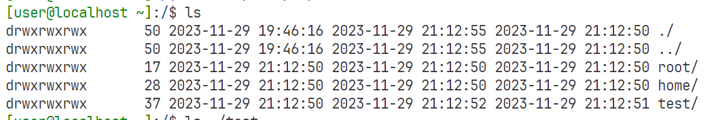
绝对路径
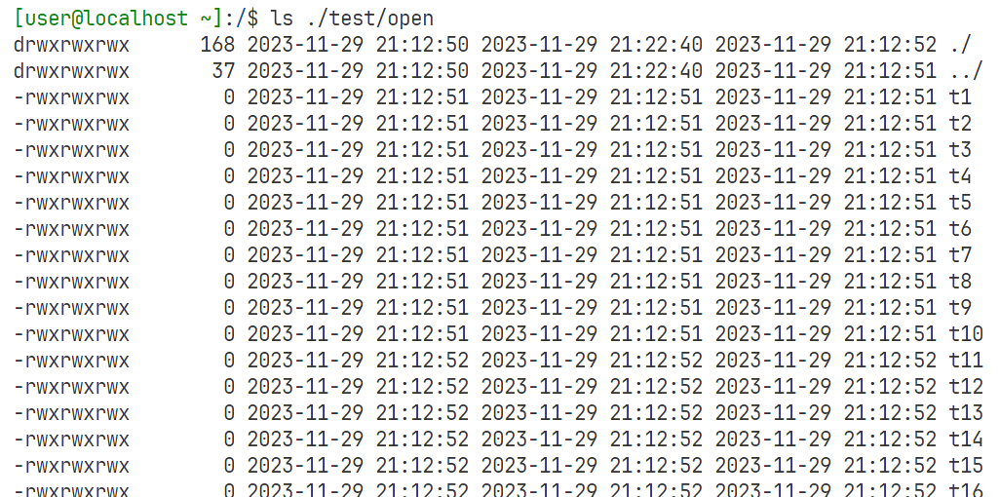
支持路径解析
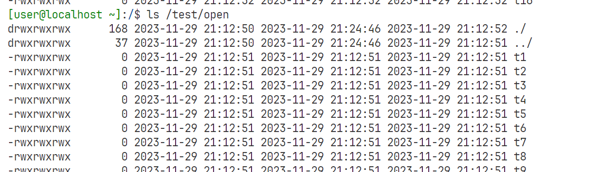

### cd

```bash
cd test
cd /test
cd /test/./../test/rw
```

支持相对路径和绝对路径，同样支持路径解析

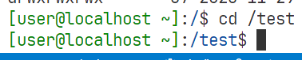


### touch and rm

```BASH
touch testfile
rm teastfile
```

测试结果
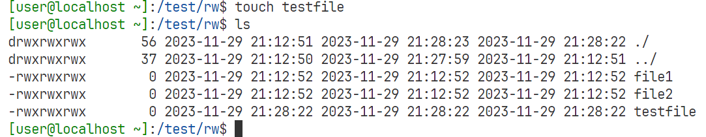
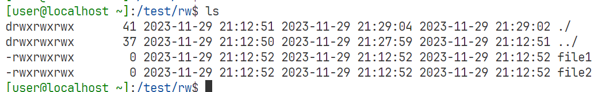

### mkdir and rmdir

创建目录
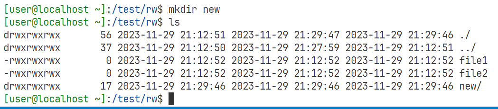
删除目录
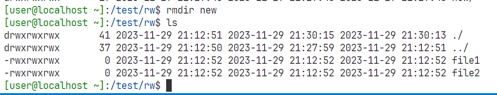
但是只能删除空目录
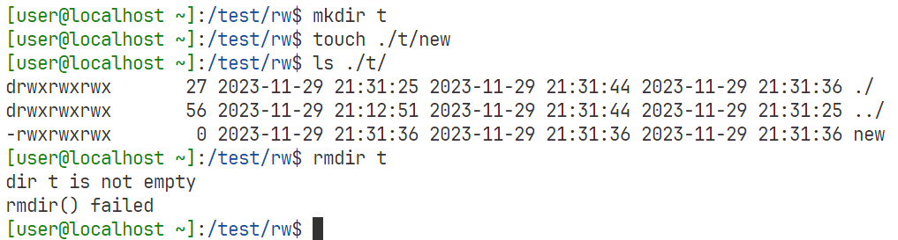
可以使用su获得权限之后使用rmdir_rec递归删除目录
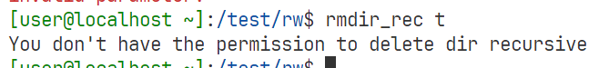
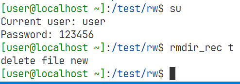

### open and close and ftable

结构体定义

```c
// 打开文件表项
struct open_file
{
    char* filename;
    __u16 inode_num;
    char* path;
    int offset;
};
```

这里定义的打开文件表项与实验要求不同，保存了文件名给用户按文件名找到文件，保存inode号便于获得数据位置，保存path作为文件路径，区别不同路径下的同名文件，保存offset作为读写指针的偏移方便随机存取


